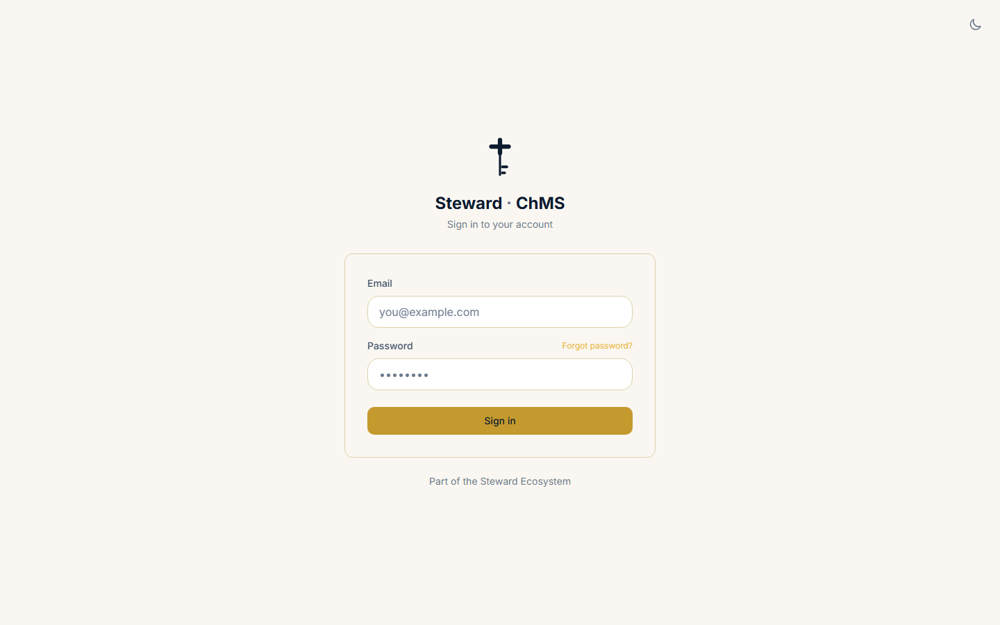
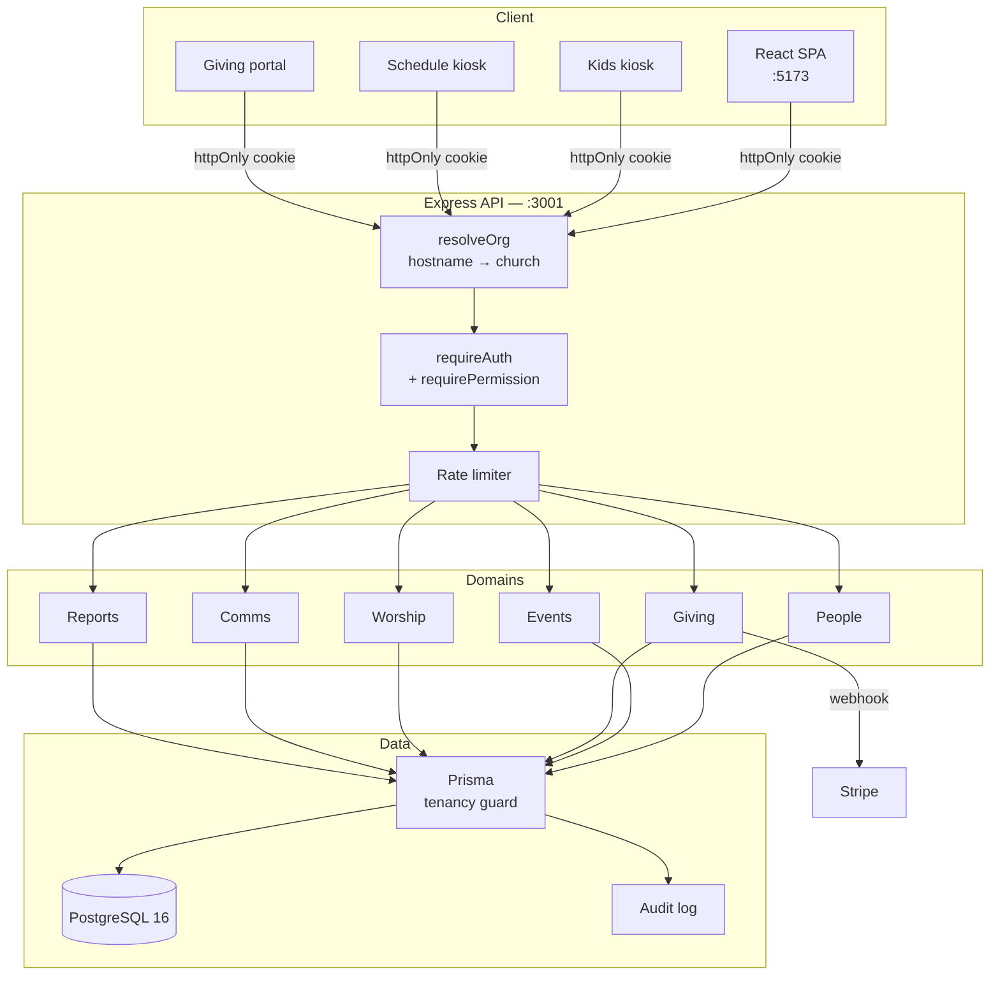

<div align="center">


<br><br>

<a href="https://github.com/24Skater/StewardChMS/actions/workflows/ci.yml"></a>
<a href="LICENSE"></a>


<br><br>

**[Quick start](#quick-start)** &nbsp;·&nbsp;
**[What it does](#what-it-does)** &nbsp;·&nbsp;
**[Architecture](#architecture)** &nbsp;·&nbsp;
**[Status](#status)** &nbsp;·&nbsp;
**[Docs](#documentation)**

</div>

<br>

Church management software a congregation owns outright. Members and households,
kids check-in, worship planning, giving and fund accounting, and the reports a
board actually asks for — in one application you run on your own server.

Also known as **Steward ChMS**. It is a full church management system, not a
general CRM with ministry words pasted over it: households, pastoral notes,
security codes on a child's label, and restricted funds are first-class, because
they are what a church office spends its week on.

<br>

<div align="center">
  
  <br>
  <sub><b>The dashboard on a Monday morning.</b> Who is new, what came in, what is coming up.</sub>
</div>

<br>

---

## What it does

<table>
<tr>
<td width="33%" valign="top">

 **People**

Member profiles, household linking, pastoral notes, tags, CSV import, search
that finds someone by half a phone number.

</td>
<td width="33%" valign="top">

 **Events and check-in**

Recurring services, online registration, and a kids kiosk that prints a label
with a security code and an allergy alert.

</td>
<td width="33%" valign="top">

 **Giving**

Stripe giving portal, any payment method recorded by hand, designated funds,
pledges, and year-end donor statements.

</td>
</tr>
<tr>
<td width="33%" valign="top">

 **Worship**

Song library with keys and BPM, ordered service plans, rehearsal notes, set list
export.

</td>
<td width="33%" valign="top">

 **Scheduling**

Rotating volunteer calendars, monthly rosters, conflict detection, and a TV
kiosk on a share link you can revoke.

</td>
<td width="33%" valign="top">

 **Reporting**

Membership, attendance, giving and fund reports. Every one of them exports to
CSV and prints to PDF.

</td>
</tr>
</table>

<details>
<summary><b>The full feature list</b> — communications, accounting, sales, and what each module actually includes</summary>

<br>

**People and households**

| Feature | Details |
| --- | --- |
| Member profiles | Contact details, status, photo, custom notes |
| Household linking | Family members connected, with a household-level view |
| Pastoral notes | Private, staff-only, per member |
| CSV bulk import | Hundreds of members from a spreadsheet |
| Status tracking | Active, Visitor, Inactive, Deceased |
| Tags | Freely assigned and searchable |

**Ministries and groups**

| Feature | Details |
| --- | --- |
| Hierarchy | Church → Ministry → Group |
| Groups | Small groups, classes, volunteer teams |
| Leader roles | Leaders with scoped permissions |
| Assignment | A member can belong to many groups |

**Events and check-in**

| Feature | Details |
| --- | --- |
| Scheduling | One-time and recurring patterns |
| Registration | Members sign up through the portal |
| Attendance | Manual and QR check-in |
| Kids check-in | Parent and child matched by security code |
| Kiosk mode | Full-screen self-service station, light and dark |
| Label printing | Thermal label with name, code, allergy alert |
| Auto-reset | Kiosk returns to idle after 60 seconds |

**Ministry scheduling**

| Feature | Details |
| --- | --- |
| Rotation calendars | Volunteers assigned to recurring slots |
| Monthly periods | Draft, then publish |
| Auto-generation | Fill slots from the rotation list |
| TV kiosk | Public full-screen display, light and dark |
| Share token | Regenerate the public link at any time |
| Conflict detection | Flags anyone double-booked |

**Worship planning**

| Feature | Details |
| --- | --- |
| Song library | Title, author, key, BPM, lyrics |
| Service plans | Ordered worship sets tied to an event |
| Key transposition | Tracked per vocalist or band |
| Rehearsal notes | Visible to the worship team |
| PDF export | The full set list, for rehearsal |

**Communications**

| Feature | Details |
| --- | --- |
| Email and SMS | Multi-channel — see the provider note under [Status](#status) |
| Audience targeting | By ministry, group, status, or individual |
| Templates | Save and reuse what gets sent often |
| History | A full log of everything sent |
| Opt-in preferences | Per member, per channel |
| Delivery status | Sent, failed, bounced |

**Giving and accounting**

| Feature | Details |
| --- | --- |
| Giving portal | Stripe-powered, public |
| Donation recording | Cash, cheque, card, ACH |
| Fund accounting | Multiple designated funds with restrictions |
| Pledges | Commitments tracked against fulfilment |
| Donor statements | Year-end contribution summaries |
| Expenses | Categorised by fund |
| Vendors | Payee records and payment history |
| Purchase orders | Creation, approval, receipt |
| Invoices | Issued and tracked with line items |
| Reports | Fund balances, income against expense |

**Sales and inventory**

| Feature | Details |
| --- | --- |
| Product catalog | Price and description |
| Inventory | Live stock with a transaction log |
| Simple POS | Quick checkout, linked to a member |
| Sales reports | Revenue by product and date range |

For a full point of sale — variants, split tender, returns, registers and tills —
use [StewardPOS](https://github.com/24Skater/stewardpos) instead. This module is
deliberately the simple case.

**Security**

| Feature | Details |
| --- | --- |
| Sessions | JWT in an httpOnly cookie |
| Roles | Admin, Staff, Ministry Leader, Scheduler |
| Permissions | `resource.action` keys checked on every endpoint |
| Audit logging | Who did what, and when |
| Passwords | bcrypt, with a complexity minimum |
| Rate limiting | On every route |
| Headers | Helmet CSP, HSTS |
| Token blacklist | Logout invalidates immediately |

</details>

<div align="center">
<table>
<tr>
<td align="center" width="50%">
<br>
<sub><b>Kids check-in kiosk</b></sub>
</td>
<td align="center" width="50%">
<br>
<sub><b>Giving</b></sub>
</td>
</tr>
</table>
</div>

---

## Quick start

**Requirements:** Docker and Docker Compose, or Node 20 with PostgreSQL 16.

```bash
git clone https://github.com/24Skater/StewardChMS.git
cd StewardChMS

# Set a database password and a JWT secret first
cp docker.env.example docker.env

docker compose up -d
```

Then open `http://localhost:5173` and sign in with `admin@example.com` /
`admin123`.

> **Change that password before entering any real data.** Admin → Settings. It
> exists so a fresh install is usable, not because it is safe.

<details>
<summary>Run it without Docker</summary>

```bash
npm ci

cp backend/env.example backend/.env
# Set DATABASE_URL and JWT_SECRET in backend/.env

npm run db:generate -w backend     # Prisma client
npm run db:migrate -w backend      # schema
npm run db:seed -w backend         # admin user and sample data

npm run dev:backend                # http://localhost:3001
npm run dev:frontend               # http://localhost:5173
```

Generate a strong secret:

```bash
node -e "console.log(require('crypto').randomBytes(48).toString('hex'))"
```

</details>

### Pages that need no login

| Path | Purpose |
| --- | --- |
| `/give` | Giving portal |
| `/give/thank-you` | Post-donation confirmation |
| `/kids-checkin/kiosk` | Self-service kids check-in |
| `/kiosk/:token` | Ministry schedule TV display |
| `/setup` | First-run setup wizard |

---

## Configuration

| Variable | Required | Default | What it does |
| --- | :--: | --- | --- |
| `DATABASE_URL` | yes | — | PostgreSQL 16 connection string |
| `JWT_SECRET` | yes | — | Session signing key, 32 characters minimum |
| `PORT` | no | `3001` | Backend listen port |
| `CORS_ORIGIN` | no | `http://localhost:5173` | Where the frontend is served from |
| `JWT_EXPIRES_IN` | no | `7d` | Session lifetime |
| `STRIPE_SECRET_KEY` | for giving | — | Stripe secret key |
| `STRIPE_PUBLISHABLE_KEY` | for giving | — | Stripe publishable key |
| `STRIPE_WEBHOOK_SECRET` | for giving | — | Verifies incoming Stripe webhooks |
| `PLATFORM_ROOT_DOMAIN` | hosted only | — | Unset means single-church self-hosted |

Full list in [`backend/env.example`](backend/env.example).

---

## Architecture

Three npm workspaces: `frontend` (React SPA), `backend` (Express REST API), and
`shared` (Zod schemas both sides validate against, so a contract cannot drift).



**Hostname decides the church, and the session has to agree.** `resolveOrg`
reads the church out of the request host, then `requireAuth` checks that the
token's `orgId` matches. A session for one church, presented to another church's
address, is refused — kiosk tokens included.

**The tenancy guard injects on reads and verifies on writes.** With 579 database
calls, a guard that demanded every caller name the church would have been 579
chances to forget. So the Prisma extension adds `orgId` to every read and
targeted write, and throws when no church is in context. Creates are the
exception: TypeScript already requires `orgId` there, so the guard *verifies* —
refusing a row that names a different church. Classify a new model in
`backend/src/lib/tenancy.ts` or `tenancy.test.ts` fails the build against
Prisma's own DMMF.

**Self-hosting is the same code path.** With no `PLATFORM_ROOT_DOMAIN`, the app
resolves the single church and behaves exactly as it did before any of this
existed.

**Logout means logout.** Revoked tokens live in a Postgres `revoked_tokens`
table rather than Redis — a church already runs a database and should not have to
run a cache as well. There is deliberately no cache in front of it, because a
stale entry would mean a signed-out token still worked.

Full reasoning in [`docs/MULTI-TENANCY.md`](docs/MULTI-TENANCY.md) and
[`docs/architecture.md`](docs/architecture.md).

### Stack

| Layer | Choice |
| --- | --- |
| Language | TypeScript 5.6, strict |
| Frontend | React 18, Vite 7, TanStack Query, Radix/shadcn, Tailwind |
| Backend | Express 4.21, Prisma 5.20 |
| Database | PostgreSQL 16 |
| Auth | JWT in an httpOnly cookie, plus RBAC |
| Validation | Zod, shared between both sides |
| Payments | Stripe |
| Testing | Vitest, Supertest against a real PostgreSQL |

---

## Status

Pre-production. No paying churches and no live congregational data, which is
worth saying plainly before anyone trusts it with a giving record.

**Shipped and working:** everything in the feature list above — people,
households, ministries, events, kids check-in with label printing, worship
planning, ministry scheduling with the TV kiosk, the giving portal and fund
accounting, expenses and purchase orders and invoices, the reporting suite, the
sales module, audit logging on every mutation, and multi-tenancy with
cross-tenant writes refused.

**Stubs, not integrations.** `email-stub.ts` and `sms-stub.ts` log to the
console. The communications module is complete up to the point of handing a
message to a provider — plug in SendGrid or Twilio there.

**Not yet proven:** no live Stripe test-mode checkout has been run against this
app.

**Known rough edges:** `frontend/src/lib/api.ts` is about 2,000 lines and wants
splitting per domain. The frontend still falls back to `localStorage` for the
auth token, though the httpOnly cookie is the intended path.

**Backlog:** mobile PWA redesign, push notifications, calendar export,
multi-campus support, volunteer availability tracking, sermon and media library,
background-check integration, member-facing tithe dashboard, outbound webhooks.

---

## The Steward family

Steward is four applications on one design system. Each one runs standalone and
self-hosted — nothing here requires the others, or us.

| Application | What it does |
| --- | --- |
| **[Congregation](https://github.com/24Skater/StewardChMS)** | Members, giving, worship planning, reporting |
| **[StewardPOS](https://github.com/24Skater/stewardpos)** | Point of sale, inventory, returns |
| **[Table](https://github.com/24Skater/steward-table)** | Food orders, kitchen display, delivery |
| **[VBS](https://github.com/24Skater/StewardVBS)** | Registration, check-in, reporting |

They share one design system — [Steward Brand](https://github.com/24Skater/steward-brand),
the tokens, components and icons every screen is built from.

---

## Documentation

Everything lives in [`docs/`](docs/README.md).

| Need | Document |
| --- | --- |
| How the system works end to end | [`docs/architecture.md`](docs/architecture.md) |
| Tenancy, host resolution, sign-in scoping | [`docs/MULTI-TENANCY.md`](docs/MULTI-TENANCY.md) |
| Auth, JWT, permission keys | [`docs/auth-permissions.md`](docs/auth-permissions.md) |
| Every API error code and shape | [`docs/api-errors.md`](docs/api-errors.md) |
| All Prisma models | [`docs/database-schema.md`](docs/database-schema.md) |
| What counts as sensitive data | [`docs/DATA-CLASSIFICATION.md`](docs/DATA-CLASSIFICATION.md) |
| Frontend patterns | [`docs/frontend-guide.md`](docs/frontend-guide.md) |
| Adding a feature domain | [`docs/extending.md`](docs/extending.md) |
| Production deployment | [`docs/deployment.md`](docs/deployment.md) |

---

## Security

A church database holds some of the most sensitive information a community has —
giving histories, pastoral notes, and which adult may collect which child.

Sessions are JWTs in httpOnly cookies with a database-backed revocation list.
Every endpoint checks a `resource.action` permission. Every mutation is audited.
Passwords are bcrypt-hashed. Rate limiting and Helmet security headers are on by
default. What is and is not sensitive is written down in
[`docs/DATA-CLASSIFICATION.md`](docs/DATA-CLASSIFICATION.md).

Please report vulnerabilities privately by email rather than in a public issue.

---

## Contributing

Bug reports, feature requests, documentation and code are all welcome.

```bash
git checkout -b feat/your-feature-name
# tests first — they live beside the source as *.test.ts
npm run typecheck && npm run lint && npm test
git commit -m "feat: describe what it does"
```

Conventional commits (`feat:`, `fix:`, `refactor:`, `docs:`, `test:`, `chore:`,
`perf:`, `ci:`). TypeScript strict with no `any`. Zod at every API boundary.
Prisma for all database access — no raw SQL. RBAC on every endpoint. 80% test
coverage. Conventions in [`CLAUDE.md`](CLAUDE.md), workflow in
[`CONTRIBUTING.md`](CONTRIBUTING.md).

---

## Licence

[MIT](LICENSE) © 2026 Steward.

<div align="center">
<br>

> *"Moreover, it is required of stewards that they be found faithful."*
> — 1 Corinthians 4:2

<br>

Built for the Church — open to all.

</div>
