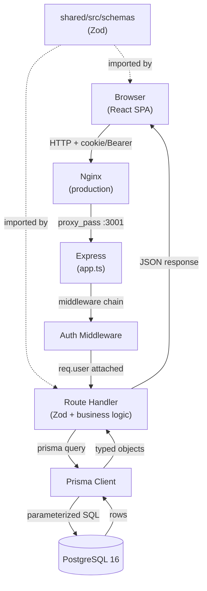
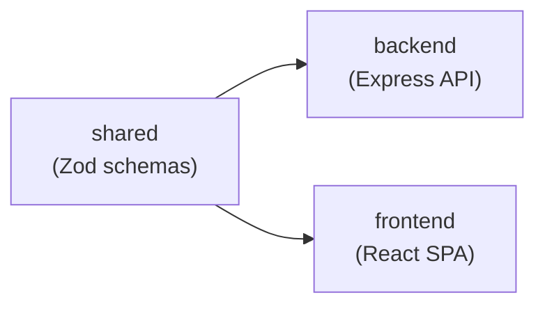

# Architecture Reference

StewardChMS is an open-source Church Management System built as an npm monorepo with three TypeScript 5.6 workspaces: a React SPA (frontend), an Express REST API (backend), and a shared Zod-schema library. It manages church members, events, worship planning, communications, giving, accounting, kids check-in, ministry scheduling, and product sales.

---

## Table of Contents

1. [System Overview](#system-overview)
2. [Monorepo Structure](#monorepo-structure)
3. [Request Lifecycle](#request-lifecycle)
4. [Data Flow](#data-flow)
5. [Three-Workspace Dependency Model](#three-workspace-dependency-model)
6. [Environment Setup and Configuration](#environment-setup-and-configuration)
7. [Key Architectural Decisions](#key-architectural-decisions)
8. [Route Inventory](#route-inventory)
9. [Deployment Topology](#deployment-topology)

---

## System Overview

| Property | Value |
|----------|-------|
| Language | TypeScript 5.6 (all workspaces) |
| Frontend | React 18, Vite 7, TanStack Query, Radix UI / shadcn, Tailwind CSS |
| Backend | Express 4.21, Prisma 5.20, PostgreSQL 16 |
| Auth | JWT in httpOnly cookie (`steward_session`) + RBAC permissions |
| Payments | Stripe SDK (backend) + Stripe.js (frontend) |
| Forms | React Hook Form + Zod validation |
| Testing | Vitest + Supertest (backend integration tests) |
| CI | GitHub Actions: lint, typecheck, test, build |

StewardChMS follows a three-tier architecture: browser to API server to database. The frontend is a static SPA served by Nginx; all data access goes through Express. PostgreSQL is the only data store; Prisma is the exclusive DB access layer.

---

## Monorepo Structure

```
stewardchms/               <- npm workspaces root
├── package.json
├── frontend/              <- React SPA (Vite)
├── backend/               <- Express REST API
├── shared/                <- Zod schemas
└── docs/
```

### `frontend/`

React SPA. Never communicates directly with PostgreSQL. Owns routing, UI state, form validation, TanStack Query data fetching.

```
frontend/src/
  pages/    <- Page components, one subdirectory per domain
  hooks/    <- Data-fetching hooks (one use*.ts per domain)
  lib/
    api.ts  <- Central HTTP client + token management
    api/    <- Per-domain API modules (e.g. schedules.ts)
  context/  <- AuthContext.tsx, ThemeContext.tsx
```

> **Note:** `frontend/src/lib/api.ts` is 1,986 lines. Split into `frontend/src/lib/api/` per-domain modules when next touching it.

### `backend/`

Owns all business logic, data access, and security enforcement.

```
backend/src/
  app.ts        <- Middleware order + route registration
  routes/       <- One file per domain
  middleware/
    auth.ts     <- requireAuth, requirePermission, optionalAuth, requirePrimaryAdmin
  lib/
    auth.ts     <- JWT sign/verify, password hashing, cookie config
    security.ts <- Env validation, password policy, token blacklist
    prisma.ts   <- Prisma singleton
backend/prisma/
  schema.prisma <- Source of truth
  migrations/   <- SQL migration history
  seed.ts       <- Seeds permissions, roles, seed account
```

### `shared/`

Zod schemas imported by both `frontend` and `backend`. The API contract layer.

> **Build order:** `shared` must be built first. In development, Vite resolves `shared/src` via TypeScript path aliases.

---

## Request Lifecycle

Complete path of a typical authenticated request, e.g. `GET /api/members`.

```
Browser: apiFetch("/api/members") with Bearer token or httpOnly cookie
  v
Nginx (production): Proxies /api/* to http://backend:3001
  v
Express middleware stack (in order)
  3. helmet()        - security headers
  4. cors()          - validates Origin against CORS_ORIGIN
  5. cookieParser()  - parses steward_session cookie
  6. express.json()  - parses JSON body (limit 5 MB)
  7. apiRateLimiter  - 100 req/min per IP
  v
Route handler
  8. requireAuth()
     - Checks cookie first, falls back to Bearer header
     - verifyToken(): signature, expiry, blacklist check
     - Attaches payload to req.user; 401 if invalid
  9. requirePermission("members.read")
     - req.user.permissions check; 403 if absent
  10. Handler: Zod validate -> Prisma query -> JSON response
  v
Prisma Client -> parameterized SQL -> PostgreSQL 16
```

### Middleware Execution Order

| Order | Middleware | Purpose |
|-------|-----------|---------|
| 1 | `helmet()` | X-Frame-Options, X-Content-Type-Options, Strict-Transport-Security |
| 2 | `cors()` | Restricts Origin to CORS_ORIGIN env var |
| 3 | `cookieParser()` | Populates req.cookies for httpOnly cookie auth |
| 4 | `express.json()` | JSON body; 5 MB limit supports CSV imports |
| 5 | `express.urlencoded()` | Form-encoded bodies |
| 6 | `apiRateLimiter` | 100 req/min per IP on /api/* |
| 7 | Route handlers | Domain-specific logic |
| 8 | 404 handler | Not-found response |

---

## Data Flow



---

## Three-Workspace Dependency Model



`shared` has zero dependencies on `backend` or `frontend`. Both import from it for:

- **Validation** - backend validates request bodies; frontend uses same schemas in React Hook Form
- **Type inference** - `z.infer<typeof schema>` is the single source of truth for API boundary types
- **Drift prevention** - schema changes produce TS errors in both consumers at build time

```bash
npm run build -w shared      # must run first
npm run build:backend
npm run build:frontend
```

---

## Environment Setup and Configuration

```bash
npm ci
cd backend && cp env.example .env && cd ..
# Edit .env: set DATABASE_URL and JWT_SECRET
npm run db:migrate -w backend
npm run db:seed -w backend
npm run dev:frontend  # http://localhost:5173
npm run dev:backend   # http://localhost:3001
```

Navigate to `/setup` after seeding to create the primary admin account.

| Variable | Required | Description |
|----------|----------|-------------|
| `DATABASE_URL` | Yes | PostgreSQL connection string |
| `JWT_SECRET` | Yes (prod) | JWT signing secret, min 32 chars in production |
| `PORT` | No | Express listen port (default 3001) |
| `CORS_ORIGIN` | No | Allowed frontend origin (default http://localhost:5173) |
| `JWT_EXPIRES_IN` | No | Token lifetime (default 7d, supports d/h/m/s) |

> **Warning:** In production, `validateEnvironment()` exits with code 1 if `JWT_SECRET` is absent, insecure, or under 32 chars, or if `CORS_ORIGIN` is `*`.

---

## Key Architectural Decisions

### JWT in httpOnly Cookie

Primary token delivery: httpOnly, SameSite=Strict, Secure (production) cookie named `steward_session`.

**Rationale:** httpOnly prevents XSS token theft. SameSite=Strict prevents CSRF. More secure than localStorage.

**Fallback:** `extractToken()` also accepts Bearer token in Authorization header for non-browser clients.

**Known issue:** `frontend/src/lib/api.ts` also stores the token in localStorage. The httpOnly cookie is the intended production path.

### Zod Validation at System Boundaries

All external input validated with Zod. `z.infer<typeof schema>` prevents type/validation drift. Shared schemas ensure frontend forms match API expectations exactly.

### Prisma as Exclusive DB Access Layer

No raw SQL. Prisma Client only. Fully-typed results, automatic parameterized queries (no SQL injection), version-controlled migration history.

### RBAC Permissions Embedded in JWT

Permissions array loaded at login, embedded in JWT. `requirePermission()` checks `req.user.permissions` in memory (zero DB lookups).

**Trade-off:** Changes take effect only after token expiry or blacklisting. `requirePrimaryAdmin()` always does a live DB check.

### In-Memory Token Blacklist

Logout writes the token's jti (UUID) to `revoked_tokens`; `verifyToken()` checks it. Survives restarts, and is shared by every instance.

### Singleton Prisma Client

Single `PrismaClient` on `globalThis` in dev. Prevents duplicate connection pools exhausting PostgreSQL `max_connections`.

### Audit Logging

`AuditLog` records written via `createAuditLog()`. Errors swallowed silently so audit failures never block primary operations.

---

## Route Inventory

All routes registered in `backend/src/app.ts`.

| Domain | Base Path | Auth | Permissions |
|--------|-----------|------|-------------|
| Health | `/api/health` | No | None |
| Auth login | `POST /api/auth/login` | No | None |
| Auth validate-password | `POST /api/auth/validate-password` | No | None |
| Auth me/logout/change-password | `/api/auth/*` | Yes | None |
| Setup wizard | `/api/setup` | No | None |
| Public settings | `/api/settings` (public) | No | None |
| Admin settings | `/api/settings` (protected) | Yes | `admin.access` |
| Members | `/api/members` | Yes | `members.read`, `members.write`, `members.delete` |
| Households | `/api/households` | Yes | `members.read`, `members.write`, `members.delete` |
| Events | `/api/events` | Yes | `events.read`, `events.write` |
| Occurrences | `/api/occurrences` | Yes | `events.read`, `events.write` |
| Registrations | nested under occurrences | Yes | `events.read`, `events.write` |
| Songs | `/api/songs` | Yes | `worship.read`, `worship.write` |
| Worship plans | nested under occurrences | Yes | `worship.read`, `worship.write` |
| Message templates | `/api/message-templates` | Yes | `communications.view`, `communications.send` |
| Messages | `/api/messages` | Yes | `communications.view`, `communications.send` |
| Opt-in | `/api/members/:id/opt-in` | Yes | `members.read`, `members.write` |
| Funds | `/api/funds` | Yes | `accounting.view`, `accounting.edit` |
| Donations | `/api/donations` | Yes | `giving.view`, `giving.edit` |
| Pledges | `/api/pledges` | Yes | `giving.view`, `giving.edit` |
| Vendors | `/api/vendors` | Yes | `accounting.view`, `accounting.edit` |
| Expenses | `/api/expenses` | Yes | `accounting.view`, `accounting.edit` |
| Invoices | `/api/invoices` | Yes | `accounting.view`, `accounting.edit` |
| Purchase orders | `/api/purchase-orders` | Yes | `accounting.view`, `accounting.edit` |
| Reports | `/api/reports` | Yes | `accounting.view`, `giving.view`, `reports.view` |
| Products | `/api/products` | Yes | `inventory.view`, `inventory.edit` |
| Inventory | `/api/inventory` | Yes | `inventory.view`, `inventory.edit` |
| Sales | `/api/sales` | Yes | `sales.view`, `sales.edit` |
| Ministries | `/api/ministries` | Yes | `groups.view`, `groups.edit` |
| Groups | `/api/groups` | Yes | `groups.view`, `groups.edit` |
| Kids check-in | `/api/kids-checkin` | Yes | `checkin.view`, `checkin.operate` |
| Online giving (webhook) | `/api/online-giving` | No | None |
| Online giving (admin) | `/api/online-giving/stats` | Yes | `giving.view` |
| Ministry calendars | `/api/ministry-calendars` | Yes | `schedules.view`, `schedules.manage` |
| Schedule periods | `/api/ministry-calendars/:calendarId/periods` | Yes | `schedules.view`, `schedules.manage` |
| Schedule slots | `/api/schedule-slots` | Yes | `schedules.manage` |
| Public kiosk | `/public/schedule` | No | None |

---

## Deployment Topology

### Docker Compose (Recommended)

```
+------------------------------------------------+
|  Docker Compose network                        |
|  +----------------------------------------+   |
|  |  nginx  (port 80, exposed to host)     |   |
|  |  Serves frontend SPA (static files)    |   |
|  |  Proxies /api/* and /public/* to :3001  |   |
|  +------------------+---------------------+   |
|                     |                         |
|  +------------------v---------------------+   |
|  |  backend  (port 3001, internal only)   |   |
|  |  Express + Prisma                      |   |
|  +------------------+---------------------+   |
|                     |                         |
|  +------------------v---------------------+   |
|  |  postgres  (port 5432, internal only)  |   |
|  |  PostgreSQL 16                         |   |
|  +----------------------------------------+   |
+------------------------------------------------+
```

### Local Development

```bash
npm run dev:frontend   # Vite dev server on http://localhost:5173
npm run dev:backend    # ts-node-dev on http://localhost:3001
```

Vite proxies `/api` and `/public` to `:3001` in development, mirroring Nginx proxy rules. Frontend code never references the backend port directly.