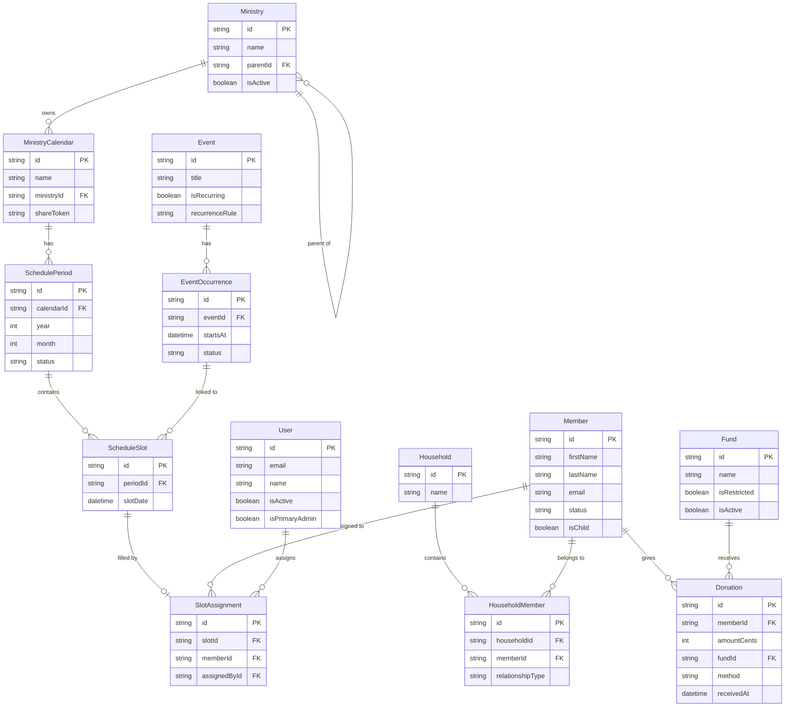

# StewardChMS — Database Schema Reference

This document describes every model in the StewardChMS PostgreSQL database, defined in `backend/prisma/schema.prisma` and managed by Prisma 5.

---

## Table of Contents

1. [Conventions](#conventions)
2. [Core Entity Relationship Diagram](#core-entity-relationship-diagram)
3. [Identity & Access](#identity--access)
4. [People & Households](#people--households)
5. [Ministries & Groups](#ministries--groups)
6. [Events & Attendance](#events--attendance)
7. [Worship](#worship)
8. [Communications](#communications)
9. [Giving & Accounting](#giving--accounting)
10. [Sales & Inventory](#sales--inventory)
11. [Ministry Scheduling](#ministry-scheduling)
12. [System](#system)
13. [Migration Workflow](#migration-workflow)
14. [Seed File](#seed-file)
15. [Common Prisma Patterns](#common-prisma-patterns)

---

## Conventions

### Field naming

| Layer | Convention | Example |
|-------|-----------|---------|
| Prisma model fields | `camelCase` | `firstName`, `createdAt` |
| PostgreSQL columns | `snake_case` via `@map` | `first_name`, `created_at` |
| Primary keys | `cuid()` string | `"clxyz1234..."` |
| Table names | `snake_case` via `@@map` | `household_members` |

### ID generation

All primary keys use `@id @default(cuid())`, producing collision-resistant 25-character strings. No integer sequences are used anywhere in the schema.

### Timestamp conventions

Every mutable model carries two standard timestamps:

```prisma
createdAt DateTime @default(now()) @map("created_at")
updatedAt DateTime @updatedAt       @map("updated_at")
```

`updatedAt` is maintained automatically by Prisma on every write. Immutable join tables (e.g., `UserRole`, `RolePermission`) omit `updatedAt`.

### Monetary values

All monetary amounts are stored as `Int` in **cents** (e.g., `amountCents`, `totalCents`, `priceCents`). No `Decimal` or `Float` types are used for money, which avoids floating-point rounding errors. A `currency` field (default `"USD"`) accompanies monetary amounts where currency matters.

### Soft-delete vs hard-delete

The schema uses `isActive Boolean @default(true)` as a soft-deactivation flag on models that represent ongoing entities with referential history. Hard-delete cascades are used for child rows where the parent deletion should remove all dependent data.

| Model | Deactivation strategy |
|-------|-----------------------|
| `User` | `isActive` flag |
| `Fund` | `isActive` flag |
| `Product` | `isActive` flag |
| `Ministry` | `isActive` flag |
| `Group` | `isActive` flag |
| `MinistryCalendar` | `isActive` flag |
| `Member` | `status` enum (`active` / `inactive` / `visitor`) |
| All child/line-item rows | Hard-delete cascade from parent |

No model uses a `deletedAt` nullable timestamp pattern.

### Audit trail

The `AuditLog` model records all significant state changes. The key fields are:

- `actorUserId` — nullable FK to `User`; `null` when the action originates from a system process (e.g., seed script)
- `action` — free-form uppercase string (e.g., `"SEED_COMPLETED"`, `"MEMBER_CREATED"`)
- `entityType` — string naming the domain entity (e.g., `"Member"`, `"Donation"`, `"System"`)
- `entityId` — nullable string holding the ID of the affected record
- `metadata` — `Json` blob for any additional context; defaults to `{}`


---

## Core Entity Relationship Diagram



---

## Identity & Access

### User

**Purpose:** A login account for a staff member, volunteer, or system process that can authenticate and perform actions in the system.

| Field | Type | Nullable | Description |
|-------|------|----------|-------------|
| `id` | `String` | No | cuid primary key |
| `email` | `String` | No | Unique login email address |
| `name` | `String` | Yes | Display name |
| `passwordHash` | `String` | No | bcrypt hash; stored in column `password_hash` |
| `isActive` | `Boolean` | No | `true` by default; `false` disables login; column `is_active` |
| `isPrimaryAdmin` | `Boolean` | No | Marks the first real admin created via setup wizard; column `is_primary_admin` |
| `isSeedAccount` | `Boolean` | No | Marks the emergency recovery seed account; column `is_seed_account` |
| `createdAt` | `DateTime` | No | Creation timestamp; column `created_at` |
| `updatedAt` | `DateTime` | No | Last-modified timestamp; column `updated_at` |

**Relations:**

- `userRoles` — roles assigned to this user via `UserRole`
- `auditLogs` — audit entries where this user was the actor (named relation `"ActorAuditLogs"`)
- `messages` — outbound messages created by this user
- `purchaseOrders` — purchase orders this user requested
- `sales` — point-of-sale transactions this user processed
- `createdCalendars` — ministry calendars this user created (named relation `"CalendarCreatedBy"`)
- `assignedSlots` — slot assignments this user made (named relation `"AssignedBy"`)

**Constraints:** `email` is `@unique`. Table is `users`.

---

### Role

**Purpose:** A named collection of permissions that can be assigned to users (e.g., `admin`, `scheduler`).

| Field | Type | Nullable | Description |
|-------|------|----------|-------------|
| `id` | `String` | No | cuid primary key |
| `name` | `String` | No | Unique role name (e.g., `"admin"`) |
| `description` | `String` | Yes | Human-readable explanation |
| `createdAt` | `DateTime` | No | Creation timestamp; column `created_at` |

**Relations:**

- `userRoles` — users who hold this role via `UserRole`
- `rolePermissions` — permissions granted to this role via `RolePermission`

**Constraints:** `name` is `@unique`. Table is `roles`.

---

### Permission

**Purpose:** A granular capability key that gates access to a specific feature or action (e.g., `"members.write"`, `"giving.edit"`).

| Field | Type | Nullable | Description |
|-------|------|----------|-------------|
| `id` | `String` | No | cuid primary key |
| `key` | `String` | No | Unique dot-notated capability key |
| `description` | `String` | Yes | Human-readable label |
| `createdAt` | `DateTime` | No | Creation timestamp; column `created_at` |

**Relations:**

- `rolePermissions` — roles that have been granted this permission via `RolePermission`

**Constraints:** `key` is `@unique`. Table is `permissions`.

Permission keys follow the `resource.action` convention:

```
admin.access      users.read        users.write       users.delete
members.read      members.write     members.delete    members.notes
events.read       events.write      worship.read      worship.write
communications.view  communications.send
giving.view       giving.edit       accounting.view   accounting.edit
reports.view      sales.view        sales.edit
inventory.view    inventory.edit
groups.view       groups.edit
checkin.view      checkin.operate
giving.online.configure
schedules.view    schedules.manage
```

---

### UserRole

**Purpose:** Join table associating users with roles (many-to-many).

| Field | Type | Nullable | Description |
|-------|------|----------|-------------|
| `userId` | `String` | No | FK to `User`; column `user_id` |
| `roleId` | `String` | No | FK to `Role`; column `role_id` |

**Constraints:** Composite primary key `(userId, roleId)`. Both FKs cascade on delete. Table is `user_roles`.

---

### RolePermission

**Purpose:** Join table associating roles with permissions (many-to-many).

| Field | Type | Nullable | Description |
|-------|------|----------|-------------|
| `roleId` | `String` | No | FK to `Role`; column `role_id` |
| `permissionId` | `String` | No | FK to `Permission`; column `permission_id` |

**Constraints:** Composite primary key `(roleId, permissionId)`. Both FKs cascade on delete. Table is `role_permissions`.

---

## People & Households

### Member

**Purpose:** A person known to the church — active member, inactive member, or visitor — with contact, demographic, and kids check-in data.

| Field | Type | Nullable | Description |
|-------|------|----------|-------------|
| `id` | `String` | No | cuid primary key |
| `firstName` | `String` | No | Given name; column `first_name` |
| `lastName` | `String` | No | Family name; column `last_name` |
| `email` | `String` | Yes | Unique contact email |
| `phone` | `String` | Yes | Phone number (no format enforced) |
| `street` | `String` | Yes | Street address line |
| `city` | `String` | Yes | City |
| `state` | `String` | Yes | State/province |
| `zip` | `String` | Yes | Postal code |
| `dateOfBirth` | `DateTime` | Yes | Date of birth; column `date_of_birth` |
| `status` | `MemberStatus` | No | `active` / `inactive` / `visitor`; default `active` |
| `notes` | `String` | Yes | Sensitive pastoral notes; requires `members.notes` permission |
| `profilePhotoUrl` | `String` | Yes | URL to profile photo; column `profile_photo_url` |
| `isChild` | `Boolean` | No | `true` for children in Kids Check-in; column `is_child` |
| `securityCode` | `String` | Yes | Unique pickup security code; column `security_code` |
| `allergies` | `String` | Yes | Allergy notes for children |
| `medicalNotes` | `String` | Yes | Medical notes for children; column `medical_notes` |
| `parentalNotes` | `String` | Yes | General parental instructions; column `parental_notes` |
| `createdAt` | `DateTime` | No | Creation timestamp; column `created_at` |
| `updatedAt` | `DateTime` | No | Last-modified timestamp; column `updated_at` |

**Relations:**

- `householdMembers` — household associations via `HouseholdMember`
- `registrations` — event registrations
- `checkIns` — event check-ins
- `worshipPlanItems` — worship service roles assigned to this member
- `messageRecipients` — messages sent to this member
- `optInPreferences` — channel opt-in/opt-out preferences
- `donations` — giving history
- `pledges` — pledge commitments
- `sales` — point-of-sale purchases
- `groupMemberships` — group memberships via `GroupMember`
- `groupLeaderships` — group leadership roles via `GroupLeader`
- `rotationMemberships` — ministry calendar rotation positions via `CalendarRotationMember`
- `slotAssignments` — scheduled service slots via `SlotAssignment`

**Indexes:** `lastName`, `email`, `status`.

**Constraints:** `email` and `securityCode` are each `@unique`. Table is `members`.

**Enum — MemberStatus:**

```prisma
enum MemberStatus {
  active
  inactive
  visitor
}
```

---

### Household

**Purpose:** A family or household unit that groups related members together for contact and reporting.

| Field | Type | Nullable | Description |
|-------|------|----------|-------------|
| `id` | `String` | No | cuid primary key |
| `name` | `String` | Yes | Household display name (e.g., "The Smith Family") |
| `createdAt` | `DateTime` | No | Creation timestamp; column `created_at` |
| `updatedAt` | `DateTime` | No | Last-modified timestamp; column `updated_at` |

**Relations:** `members` — household members via `HouseholdMember`.

Table is `households`.

---

### HouseholdMember

**Purpose:** Join table linking a member to a household with a typed relationship role.

| Field | Type | Nullable | Description |
|-------|------|----------|-------------|
| `id` | `String` | No | cuid primary key |
| `householdId` | `String` | No | FK to `Household`; column `household_id` |
| `memberId` | `String` | No | FK to `Member`; column `member_id` |
| `relationshipType` | `RelationshipType` | No | `parent` / `child` / `spouse` / `other`; column `relationship_type` |

**Relations:** `household` — cascade on delete. `member` — cascade on delete.

**Indexes:** `householdId`, `memberId`.

**Constraints:** `@@unique([householdId, memberId])` prevents duplicate links. Table is `household_members`.

**Enum — RelationshipType:**

```prisma
enum RelationshipType {
  parent
  child
  spouse
  other
}
```

---
## Ministries & Groups

### Ministry

**Purpose:** A named area of church service (e.g., Worship, Youth, Outreach) that can contain groups, calendars, and events, with optional parent/child hierarchy.

| Field | Type | Nullable | Description |
|-------|------|----------|-------------|
| `id` | `String` | No | cuid primary key |
| `name` | `String` | No | Unique ministry name |
| `description` | `String` | Yes | Extended description |
| `parentId` | `String` | Yes | Self-referential FK for sub-ministries; column `parent_id` |
| `isActive` | `Boolean` | No | Soft-deactivation flag; default `true`; column `is_active` |
| `createdAt` | `DateTime` | No | Creation timestamp; column `created_at` |
| `updatedAt` | `DateTime` | No | Last-modified timestamp; column `updated_at` |

**Relations:**

- `parent` — optional parent Ministry (self-relation `"MinistryHierarchy"`; SetNull on delete)
- `children` — child ministries (self-relation `"MinistryHierarchy"`)
- `groups` — groups belonging to this ministry
- `calendars` — ministry scheduling calendars

**Indexes:** `parentId`.

**Constraints:** `name` is `@unique`. Table is `ministries`.

---

### Group

**Purpose:** A sub-group within a ministry (e.g., a small group, choir, or committee) with optional scheduling metadata.

| Field | Type | Nullable | Description |
|-------|------|----------|-------------|
| `id` | `String` | No | cuid primary key |
| `name` | `String` | No | Group display name |
| `ministryId` | `String` | No | FK to Ministry; column `ministry_id` |
| `description` | `String` | Yes | Group description |
| `meetingDay` | `String` | Yes | Day of week the group meets; column `meeting_day` |
| `meetingTime` | `String` | Yes | Time the group meets; column `meeting_time` |
| `location` | `String` | Yes | Meeting location |
| `capacity` | `Int` | Yes | Maximum headcount |
| `isActive` | `Boolean` | No | Soft-deactivation flag; default `true`; column `is_active` |
| `createdAt` | `DateTime` | No | Creation timestamp; column `created_at` |
| `updatedAt` | `DateTime` | No | Last-modified timestamp; column `updated_at` |

**Relations:** `ministry` (cascade on delete), `members` via GroupMember, `leaders` via GroupLeader.

**Indexes:** `ministryId`. Table is `groups`.

---

### GroupMember

**Purpose:** Join table tracking which members belong to which group, with an enrollment date.

| Field | Type | Nullable | Description |
|-------|------|----------|-------------|
| `id` | `String` | No | cuid primary key |
| `groupId` | `String` | No | FK to Group; column `group_id` |
| `memberId` | `String` | No | FK to Member; column `member_id` |
| `joinedAt` | `DateTime` | No | When the member joined; default `now()`; column `joined_at` |

**Constraints:** `@@unique([groupId, memberId])`. Both FKs cascade on delete. Table is `group_members`.

---

### GroupLeader

**Purpose:** Join table designating members as leaders of a group with an optional role label.

| Field | Type | Nullable | Description |
|-------|------|----------|-------------|
| `id` | `String` | No | cuid primary key |
| `groupId` | `String` | No | FK to Group; column `group_id` |
| `memberId` | `String` | No | FK to Member; column `member_id` |
| `role` | `String` | No | Leadership role label; default `"leader"` |

**Constraints:** `@@unique([groupId, memberId])`. Both FKs cascade on delete. Table is `group_leaders`.

---
## Events & Attendance

### Event

**Purpose:** A named church event definition (e.g., "Sunday Service", "Youth Night") that acts as a template and may have one or many dated occurrences.

| Field | Type | Nullable | Description |
|-------|------|----------|-------------|
| `id` | `String` | No | cuid primary key |
| `title` | `String` | No | Event title |
| `description` | `String` | Yes | Extended description |
| `location` | `String` | Yes | Physical or virtual location |
| `category` | `String` | Yes | Grouping tag (e.g., "Worship", "Outreach") |
| `ministryId` | `String` | Yes | Optional reference to an owning ministry; column `ministry_id` (no Prisma relation declared — bare string FK) |
| `isRecurring` | `Boolean` | No | Whether the event repeats; default `false`; column `is_recurring` |
| `recurrenceRule` | `String` | Yes | iCal RRULE string for recurring events; column `recurrence_rule` |
| `startDatetime` | `DateTime` | Yes | Template start time; column `start_datetime` |
| `endDatetime` | `DateTime` | Yes | Template end time; column `end_datetime` |
| `createdAt` | `DateTime` | No | Creation timestamp; column `created_at` |
| `updatedAt` | `DateTime` | No | Last-modified timestamp; column `updated_at` |

**Relations:** `occurrences` — concrete instances via EventOccurrence.

**Indexes:** `category`, `startDatetime`.

> **Note:** `ministryId` is stored as a bare `String?` field with no Prisma relation declaration. The FK to the `ministries` table is not enforced at the Prisma layer. If you need a populated ministry object on an event, join manually.

Table is `events`.

---

### EventOccurrence

**Purpose:** A concrete, dated instance of an event — the actual service or gathering on a specific day and time.

| Field | Type | Nullable | Description |
|-------|------|----------|-------------|
| `id` | `String` | No | cuid primary key |
| `eventId` | `String` | No | FK to Event; column `event_id` |
| `startsAt` | `DateTime` | No | Actual start time; column `starts_at` |
| `endsAt` | `DateTime` | Yes | Actual end time; column `ends_at` |
| `status` | `OccurrenceStatus` | No | `scheduled` / `canceled`; default `scheduled` |
| `notes` | `String` | Yes | Staff-only notes for this occurrence |

**Relations:**

- `event` — parent event definition (cascade on delete)
- `registrations` — pre-registrations for this occurrence
- `checkIns` — attendance check-ins
- `worshipPlan` — optional one-to-one worship plan
- `scheduleSlots` — ministry scheduling slots linked to this occurrence

**Indexes:** `startsAt`, `eventId`.

**Constraints:** `@@unique([eventId, startsAt])` prevents duplicate occurrences for the same event at the same start time. Table is `event_occurrences`.

**Enum — OccurrenceStatus:**

```prisma
enum OccurrenceStatus {
  scheduled
  canceled
}
```

---

### Registration

**Purpose:** A pre-event signup by either a member or a named guest, tracking party size and registration status.

| Field | Type | Nullable | Description |
|-------|------|----------|-------------|
| `id` | `String` | No | cuid primary key |
| `eventOccurrenceId` | `String` | No | FK to EventOccurrence; column `event_occurrence_id` |
| `memberId` | `String` | Yes | FK to Member; null for guest registrations; column `member_id` |
| `guestName` | `String` | Yes | Full name for walk-in guests; column `guest_name` |
| `guestEmail` | `String` | Yes | Email for walk-in guests; column `guest_email` |
| `guestPhone` | `String` | Yes | Phone for walk-in guests; column `guest_phone` |
| `partySize` | `Int` | No | Number of people in the registration; default `1`; column `party_size` |
| `status` | `RegistrationStatus` | No | `registered` / `canceled`; default `registered` |
| `createdAt` | `DateTime` | No | Registration timestamp; column `created_at` |

**Relations:** `occurrence` (cascade on delete), `member` (SetNull on delete).

**Indexes:** `eventOccurrenceId`, `memberId`. Table is `registrations`.

**Enum — RegistrationStatus:**

```prisma
enum RegistrationStatus {
  registered
  canceled
}
```

---

### CheckIn

**Purpose:** Records an actual attendance event — a person physically arriving at (and optionally departing from) an event occurrence.

| Field | Type | Nullable | Description |
|-------|------|----------|-------------|
| `id` | `String` | No | cuid primary key |
| `eventOccurrenceId` | `String` | No | FK to EventOccurrence; column `event_occurrence_id` |
| `memberId` | `String` | Yes | FK to Member; null for guest check-ins; column `member_id` |
| `guestName` | `String` | Yes | Name for walk-in guests; column `guest_name` |
| `checkedInAt` | `DateTime` | No | Arrival timestamp; default `now()`; column `checked_in_at` |
| `checkedOutAt` | `DateTime` | Yes | Departure timestamp; null until checkout; column `checked_out_at` |
| `method` | `String` | No | How the check-in was performed (e.g., `"manual"`, `"kiosk"`); default `"manual"` |

**Relations:** `occurrence` (cascade on delete), `member` (SetNull on delete).

**Indexes:** `eventOccurrenceId`, `memberId`. Table is `check_ins`.

---
## Worship

### Song

**Purpose:** A song in the church music library, with metadata for worship planning.

| Field | Type | Nullable | Description |
|-------|------|----------|-------------|
| `id` | `String` | No | cuid primary key |
| `title` | `String` | No | Song title |
| `artist` | `String` | Yes | Artist or composer |
| `defaultKey` | `String` | Yes | Musical key (e.g., `"G"`, `"Bb"`); column `default_key` |
| `bpm` | `Int` | Yes | Beats per minute |
| `lyrics` | `String` | Yes | Full lyric text |
| `createdAt` | `DateTime` | No | Creation timestamp; column `created_at` |
| `updatedAt` | `DateTime` | No | Last-modified timestamp; column `updated_at` |

**Relations:** `worshipPlanItems` — plan items that reference this song.

**Indexes:** `title`. Table is `songs`.

---

### WorshipPlan

**Purpose:** A service order — the complete rundown for a specific event occurrence — containing ordered items such as songs, prayers, and readings.

| Field | Type | Nullable | Description |
|-------|------|----------|-------------|
| `id` | `String` | No | cuid primary key |
| `eventOccurrenceId` | `String` | No | FK to EventOccurrence; unique — one plan per occurrence; column `event_occurrence_id` |
| `title` | `String` | Yes | Plan title |
| `notes` | `String` | Yes | Worship leader notes |
| `createdAt` | `DateTime` | No | Creation timestamp; column `created_at` |
| `updatedAt` | `DateTime` | No | Last-modified timestamp; column `updated_at` |

**Relations:** `occurrence` (cascade on delete; `@unique` enforces 1:1), `items` via WorshipPlanItem.

Table is `worship_plans`.

---

### WorshipPlanItem

**Purpose:** A single ordered item in a worship service plan — a song, prayer, announcement, or other segment — optionally assigned to a member.

| Field | Type | Nullable | Description |
|-------|------|----------|-------------|
| `id` | `String` | No | cuid primary key |
| `worshipPlanId` | `String` | No | FK to WorshipPlan; column `worship_plan_id` |
| `sortOrder` | `Int` | No | Display order within the plan; column `sort_order` |
| `itemType` | `String` | No | Type label (e.g., `"song"`, `"prayer"`, `"reading"`); column `item_type` |
| `title` | `String` | No | Display title for the item |
| `details` | `String` | Yes | Additional notes |
| `songId` | `String` | Yes | FK to Song; populated when `itemType` is `"song"`; column `song_id` |
| `assignedMemberId` | `String` | Yes | FK to Member; person responsible for this item; column `assigned_member_id` |
| `durationMinutes` | `Int` | Yes | Planned duration in minutes; column `duration_minutes` |

**Relations:** `worshipPlan` (cascade on delete), `song` (SetNull on delete), `assignedMember` (SetNull on delete).

**Indexes:** `worshipPlanId`, `songId`. Table is `worship_plan_items`.

---
## Communications

### Message

**Purpose:** A single outbound communication — email or SMS — sent to one or more recipients.

| Field | Type | Nullable | Description |
|-------|------|----------|-------------|
| `id` | `String` | No | cuid primary key |
| `channel` | `MessageChannel` | No | `email` / `sms` |
| `subject` | `String` | Yes | Email subject line; null for SMS |
| `body` | `String` | No | Message body text |
| `createdByUserId` | `String` | No | FK to User who sent this message; column `created_by_user_id` |
| `createdAt` | `DateTime` | No | Send timestamp; column `created_at` |

**Relations:** `createdByUser`, `recipients` via MessageRecipient.

**Indexes:** `createdAt`. Table is `messages`.

**Enum — MessageChannel:**

```prisma
enum MessageChannel {
  email
  sms
}
```

---

### MessageRecipient

**Purpose:** A delivery record for one recipient of a message, tracking delivery status and errors.

| Field | Type | Nullable | Description |
|-------|------|----------|-------------|
| `id` | `String` | No | cuid primary key |
| `messageId` | `String` | No | FK to Message; column `message_id` |
| `memberId` | `String` | Yes | FK to Member; null for non-member recipients; column `member_id` |
| `guestContact` | `Json` | Yes | Contact info for non-member recipients (arbitrary JSON); column `guest_contact` |
| `deliveryStatus` | `DeliveryStatus` | No | `pending` / `sent` / `failed`; default `pending`; column `delivery_status` |
| `deliveredAt` | `DateTime` | Yes | Timestamp when delivery was confirmed; column `delivered_at` |
| `errorMessage` | `String` | Yes | Error detail if delivery failed; column `error_message` |

**Relations:** `message` (cascade on delete), `member` (SetNull on delete).

**Indexes:** `messageId`, `deliveryStatus`. Table is `message_recipients`.

**Enum — DeliveryStatus:**

```prisma
enum DeliveryStatus {
  pending
  sent
  failed
}
```

---

### MessageTemplate

**Purpose:** A reusable message template with placeholder variables for scheduled or automated communications.

| Field | Type | Nullable | Description |
|-------|------|----------|-------------|
| `id` | `String` | No | cuid primary key |
| `name` | `String` | No | Template identifier key (e.g., `"schedule.assigned"`) |
| `channel` | `MessageChannel` | No | `email` / `sms` |
| `subject` | `String` | Yes | Email subject template |
| `body` | `String` | No | Body template with `{placeholder}` variables |
| `createdAt` | `DateTime` | No | Creation timestamp; column `created_at` |
| `updatedAt` | `DateTime` | No | Last-modified timestamp; column `updated_at` |

The seed file creates two built-in templates:

| Name | Channel | Purpose |
|------|---------|---------|
| `schedule.assigned` | email | Notifies a member they have been scheduled for a duty |
| `schedule.reminder` | email | Sends a reminder before an upcoming duty |

Template variables: `{name}`, `{duty}`, `{date}`, `{days}`, `{church_name}`.

Table is `message_templates`.

---

### OptInPreference

**Purpose:** Tracks each member opt-in or opt-out status for each communication channel.

| Field | Type | Nullable | Description |
|-------|------|----------|-------------|
| `id` | `String` | No | cuid primary key |
| `memberId` | `String` | No | FK to Member; column `member_id` |
| `channel` | `MessageChannel` | No | `email` / `sms` |
| `isOptedIn` | `Boolean` | No | `true` = opted in; `false` = opted out; default `true`; column `is_opted_in` |
| `updatedAt` | `DateTime` | No | Last preference change timestamp; column `updated_at` |

**Relations:** `member` (cascade on delete).

**Constraints:** `@@unique([memberId, channel])` ensures one row per member per channel. Table is `opt_in_preferences`.

---

## Giving & Accounting

### Fund

**Purpose:** A named bucket for tracking designated or restricted financial activity (e.g., General Fund, Building Fund, Missions).

| Field | Type | Nullable | Description |
|-------|------|----------|-------------|
| `id` | `String` | No | cuid primary key |
| `name` | `String` | No | Unique fund name |
| `description` | `String` | Yes | Fund description |
| `isRestricted` | `Boolean` | No | Whether funds are restricted-use; default `false`; column `is_restricted` |
| `isActive` | `Boolean` | No | Soft-deactivation flag; default `true`; column `is_active` |
| `createdAt` | `DateTime` | No | Creation timestamp; column `created_at` |
| `updatedAt` | `DateTime` | No | Last-modified timestamp; column `updated_at` |

**Relations:** `donations`, `pledges`, `expenses` — all use SetNull on fund delete.

**Constraints:** `name` is `@unique`. Table is `funds`.

---

### Donation

**Purpose:** A single financial contribution received from a member or guest, with optional Stripe integration for online giving.

| Field | Type | Nullable | Description |
|-------|------|----------|-------------|
| `id` | `String` | No | cuid primary key |
| `memberId` | `String` | Yes | FK to Member; null for anonymous/guest; column `member_id` |
| `guestName` | `String` | Yes | Donor name when not a member; column `guest_name` |
| `guestEmail` | `String` | Yes | Donor email when not a member; column `guest_email` |
| `amountCents` | `Int` | No | Donation amount in cents; column `amount_cents` |
| `currency` | `String` | No | ISO currency code; default `"USD"` |
| `fundId` | `String` | Yes | FK to Fund; null for undesignated gifts; column `fund_id` |
| `method` | `PaymentMethod` | No | `cash` / `check` / `card` / `online` / `other` |
| `receivedAt` | `DateTime` | No | Date the donation was received; column `received_at` |
| `note` | `String` | Yes | Staff notes |
| `stripePaymentIntentId` | `String` | Yes | Stripe PaymentIntent ID; `@unique`; column `stripe_payment_intent_id` |
| `stripeChargeId` | `String` | Yes | Stripe Charge ID; `@unique`; column `stripe_charge_id` |
| `stripeStatus` | `String` | Yes | Latest Stripe status string; column `stripe_status` |
| `isOnline` | `Boolean` | No | `true` when donated via Stripe; default `false`; column `is_online` |
| `createdAt` | `DateTime` | No | Record creation timestamp; column `created_at` |

**Relations:** `member` (SetNull on delete), `fund` (SetNull on delete).

**Indexes:** `receivedAt`, `memberId`, `fundId`, `stripePaymentIntentId`. Table is `donations`.

**Enum — PaymentMethod:**

```prisma
enum PaymentMethod {
  cash
  check
  card
  online
  other
}
```

---
### Pledge

**Purpose:** A member commitment to give a specified amount to a fund, optionally over a date range.

| Field | Type | Nullable | Description |
|-------|------|----------|-------------|
| `id` | `String` | No | cuid primary key |
| `memberId` | `String` | No | FK to Member; column `member_id` |
| `fundId` | `String` | Yes | FK to Fund; null for undesignated pledges; column `fund_id` |
| `amountCents` | `Int` | No | Total pledged amount in cents; column `amount_cents` |
| `startDate` | `DateTime` | Yes | Pledge period start; column `start_date` |
| `endDate` | `DateTime` | Yes | Pledge period end; column `end_date` |
| `status` | `PledgeStatus` | No | `active` / `completed` / `canceled`; default `active` |
| `createdAt` | `DateTime` | No | Creation timestamp; column `created_at` |
| `updatedAt` | `DateTime` | No | Last-modified timestamp; column `updated_at` |

**Relations:** `member` (cascade on delete), `fund` (SetNull on delete).

**Indexes:** `status`, `memberId`, `fundId`. Table is `pledges`.

**Enum — PledgeStatus:**

```prisma
enum PledgeStatus {
  active
  completed
  canceled
}
```

---
### Vendor

**Purpose:** A supplier or service provider to whom the church makes payments.

| Field | Type | Nullable | Description |
|-------|------|----------|-------------|
| `id` | `String` | No | cuid primary key |
| `name` | `String` | No | Unique vendor name |
| `email` | `String` | Yes | Vendor email |
| `phone` | `String` | Yes | Vendor phone |
| `street` | `String` | Yes | Street address |
| `city` | `String` | Yes | City |
| `state` | `String` | Yes | State |
| `zip` | `String` | Yes | Postal code |
| `createdAt` | `DateTime` | No | Creation timestamp; column `created_at` |
| `updatedAt` | `DateTime` | No | Last-modified timestamp; column `updated_at` |

**Relations:** `expenses`, `invoices`, `purchaseOrders` — all use SetNull on vendor delete.

**Constraints:** `name` is `@unique`. Table is `vendors`.

---
### Expense

**Purpose:** A single expenditure charged against a fund and optionally linked to a vendor.

| Field | Type | Nullable | Description |
|-------|------|----------|-------------|
| `id` | `String` | No | cuid primary key |
| `vendorId` | `String` | Yes | FK to Vendor; null for non-vendor expenses; column `vendor_id` |
| `fundId` | `String` | Yes | FK to Fund; null for unallocated expenses; column `fund_id` |
| `amountCents` | `Int` | No | Amount in cents; column `amount_cents` |
| `currency` | `String` | No | ISO currency code; default "USD" |
| `expenseDate` | `DateTime` | No | Date the expense occurred; column `expense_date` |
| `category` | `String` | Yes | Expense category label |
| `note` | `String` | Yes | Staff notes |
| `createdAt` | `DateTime` | No | Record creation timestamp; column `created_at` |

**Relations:** `vendor` (SetNull on delete), `fund` (SetNull on delete).

**Indexes:** `expenseDate`, `vendorId`, `fundId`. Table is `expenses`.

---
### Invoice

**Purpose:** A formal billing document issued to or received from a vendor, with line items and lifecycle status.

| Field | Type | Nullable | Description |
|-------|------|----------|-------------|
| `id` | `String` | No | cuid primary key |
| `invoiceNumber` | `String` | No | Unique human-readable invoice number; column `invoice_number` |
| `vendorId` | `String` | Yes | FK to Vendor; column `vendor_id` |
| `billToName` | `String` | Yes | Billing party name; column `bill_to_name` |
| `issueDate` | `DateTime` | No | Date issued; column `issue_date` |
| `dueDate` | `DateTime` | Yes | Payment due date; column `due_date` |
| `status` | `InvoiceStatus` | No | `draft` / `sent` / `paid` / `void`; default `draft` |
| `subtotalCents` | `Int` | No | Pre-tax total in cents; column `subtotal_cents` |
| `taxCents` | `Int` | No | Tax amount in cents; default `0`; column `tax_cents` |
| `totalCents` | `Int` | No | Final total in cents; column `total_cents` |
| `note` | `String` | Yes | Invoice notes |
| `createdAt` | `DateTime` | No | Creation timestamp; column `created_at` |
| `updatedAt` | `DateTime` | No | Last-modified timestamp; column `updated_at` |

**Relations:** `vendor` (SetNull on delete), `items` via InvoiceItem.

**Indexes:** `status`, `issueDate`.

**Constraints:** `invoiceNumber` is `@unique`. Table is `invoices`.

**Enum — InvoiceStatus:**

```prisma
enum InvoiceStatus {
  draft
  sent
  paid
  void
}
```

---
### InvoiceItem

**Purpose:** A single line item on an invoice, capturing description, quantity, unit price, and calculated line total.

| Field | Type | Nullable | Description |
|-------|------|----------|-------------|
| `id` | `String` | No | cuid primary key |
| `invoiceId` | `String` | No | FK to Invoice; column `invoice_id` |
| `description` | `String` | No | Line item description |
| `quantity` | `Float` | No | Item quantity (float supports fractional units) |
| `unitPriceCents` | `Int` | No | Per-unit price in cents; column `unit_price_cents` |
| `lineTotalCents` | `Int` | No | quantity x unitPriceCents; column `line_total_cents` |
| `sortOrder` | `Int` | No | Display order; column `sort_order` |

**Relations:** `invoice` (cascade on delete).

**Indexes:** `invoiceId`. Table is `invoice_items`.

---
### PurchaseOrder

**Purpose:** An internal procurement document authorizing the purchase of goods or services from a vendor, with an approval workflow status.

| Field | Type | Nullable | Description |
|-------|------|----------|-------------|
| `id` | `String` | No | cuid primary key |
| `poNumber` | `String` | No | Unique PO number; column `po_number` |
| `vendorId` | `String` | Yes | FK to Vendor; column `vendor_id` |
| `requestorUserId` | `String` | Yes | FK to User who requested the PO; column `requestor_user_id` |
| `issueDate` | `DateTime` | No | Date the PO was issued; column `issue_date` |
| `status` | `PurchaseOrderStatus` | No | `draft` / `submitted` / `approved` / `rejected` / `closed` / `void`; default `draft` |
| `subtotalCents` | `Int` | No | Pre-tax total in cents; column `subtotal_cents` |
| `taxCents` | `Int` | No | Tax amount in cents; default `0`; column `tax_cents` |
| `totalCents` | `Int` | No | Final total in cents; column `total_cents` |
| `note` | `String` | Yes | PO notes |
| `createdAt` | `DateTime` | No | Creation timestamp; column `created_at` |
| `updatedAt` | `DateTime` | No | Last-modified timestamp; column `updated_at` |

**Relations:** `vendor` (SetNull on delete), `requestorUser` (SetNull on delete), `items` via PurchaseOrderItem.

**Indexes:** `status`, `issueDate`.

**Constraints:** `poNumber` is `@unique`. Table is `purchase_orders`.

**Enum — PurchaseOrderStatus:**

```prisma
enum PurchaseOrderStatus {
  draft
  submitted
  approved
  rejected
  closed
  void
}
```

---
### PurchaseOrderItem

**Purpose:** A single line item on a purchase order, matching the structure of InvoiceItem.

| Field | Type | Nullable | Description |
|-------|------|----------|-------------|
| `id` | `String` | No | cuid primary key |
| `purchaseOrderId` | `String` | No | FK to PurchaseOrder; column `purchase_order_id` |
| `description` | `String` | No | Line item description |
| `quantity` | `Float` | No | Item quantity |
| `unitPriceCents` | `Int` | No | Per-unit price in cents; column `unit_price_cents` |
| `lineTotalCents` | `Int` | No | quantity x unitPriceCents; column `line_total_cents` |
| `sortOrder` | `Int` | No | Display order; column `sort_order` |

**Relations:** `purchaseOrder` (cascade on delete).

**Indexes:** `purchaseOrderId`. Table is `purchase_order_items`.

---

## Sales & Inventory

### Product

**Purpose:** An item the church sells at point-of-sale (books, merchandise, event tickets, etc.).

| Field | Type | Nullable | Description |
|-------|------|----------|-------------|
| `id` | `String` | No | cuid primary key |
| `name` | `String` | No | Unique product name |
| `description` | `String` | Yes | Product description |
| `sku` | `String` | Yes | Unique stock-keeping unit code |
| `priceCents` | `Int` | No | Default selling price in cents; column `price_cents` |
| `currency` | `String` | No | ISO currency code; default "USD" |
| `isActive` | `Boolean` | No | Soft-deactivation flag; default `true`; column `is_active` |
| `createdAt` | `DateTime` | No | Creation timestamp; column `created_at` |
| `updatedAt` | `DateTime` | No | Last-modified timestamp; column `updated_at` |

**Relations:** `inventoryTransactions` — stock movement history. `saleItems` — line items that sold this product.

**Indexes:** `isActive`.

**Constraints:** `name` and `sku` are each `@unique`. Table is `products`.

---

### InventoryTransaction

**Purpose:** An immutable record of a quantity change to a product stock — purchases (incoming), sales (outgoing), returns, or manual adjustments.

| Field | Type | Nullable | Description |
|-------|------|----------|-------------|
| `id` | `String` | No | cuid primary key |
| `productId` | `String` | No | FK to Product; column `product_id` |
| `type` | `InventoryTransactionType` | No | `adjustment` / `purchase` / `sale` / `return` |
| `quantityDelta` | `Int` | No | Signed quantity change (positive = increase, negative = decrease); column `quantity_delta` |
| `note` | `String` | Yes | Notes explaining the transaction |
| `createdAt` | `DateTime` | No | Transaction timestamp; column `created_at` |

**Relations:** `product` (cascade on delete).

**Indexes:** `productId`, `createdAt`. Table is `inventory_transactions`.

> Current inventory level is computed by summing `quantityDelta` across all transactions for a product. There is no denormalized stock count field.

**Enum — InventoryTransactionType:**

```prisma
enum InventoryTransactionType {
  adjustment
  purchase
  sale
  return
}
```

---
### Sale

**Purpose:** A point-of-sale transaction — a completed or voided sale to a member or guest, with totals and line items.

| Field | Type | Nullable | Description |
|-------|------|----------|-------------|
| `id` | `String` | No | cuid primary key |
| `saleNumber` | `String` | No | Unique human-readable sale number; column `sale_number` |
| `memberId` | `String` | Yes | FK to Member; null for guest sales; column `member_id` |
| `guestName` | `String` | Yes | Buyer name for non-member sales; column `guest_name` |
| `status` | `SaleStatus` | No | `completed` / `void`; default `completed` |
| `subtotalCents` | `Int` | No | Pre-tax total in cents; column `subtotal_cents` |
| `taxCents` | `Int` | No | Tax amount in cents; default `0`; column `tax_cents` |
| `totalCents` | `Int` | No | Final total in cents; column `total_cents` |
| `soldAt` | `DateTime` | No | Transaction timestamp; column `sold_at` |
| `createdByUserId` | `String` | No | FK to User who processed the sale; column `created_by_user_id` |
| `createdAt` | `DateTime` | No | Record creation timestamp; column `created_at` |

**Relations:** `member` (SetNull on delete), `createdByUser`, `items` via SaleItem.

**Indexes:** `saleNumber`, `soldAt`, `status`, `createdByUserId`. Table is `sales`.

**Enum — SaleStatus:**

```prisma
enum SaleStatus {
  completed
  void
}
```

---
### SaleItem

**Purpose:** A single line item within a sale, capturing the product sold, quantity, and prices at time of sale.

| Field | Type | Nullable | Description |
|-------|------|----------|-------------|
| `id` | `String` | No | cuid primary key |
| `saleId` | `String` | No | FK to Sale; column `sale_id` |
| `productId` | `String` | No | FK to Product; column `product_id` |
| `quantity` | `Int` | No | Number of units sold |
| `unitPriceCents` | `Int` | No | Price per unit at time of sale in cents; column `unit_price_cents` |
| `lineTotalCents` | `Int` | No | quantity x unitPriceCents; column `line_total_cents` |
| `sortOrder` | `Int` | No | Display order within the sale; column `sort_order` |

**Relations:** `sale` (cascade on delete), `product` (Restrict on delete — a product with historical sales cannot be hard-deleted).

**Indexes:** `saleId`, `productId`. Table is `sale_items`.

> **Note:** SaleItem uses `onDelete: Restrict` for the product FK, unlike most other child models. This prevents deleting a product that has associated sales history.

---

## Ministry Scheduling

### MinistryCalendar

**Purpose:** A scheduling calendar for a ministry that defines a rotation of members serving across recurring slots, with a public shareable view.

| Field | Type | Nullable | Description |
|-------|------|----------|-------------|
| `id` | `String` | No | cuid primary key |
| `name` | `String` | No | Calendar display name |
| `description` | `String` | Yes | Extended description |
| `ministryId` | `String` | No | FK to Ministry; column `ministry_id` |
| `shareToken` | `String` | No | Unique random token for the public read-only schedule URL; column `share_token` |
| `reminderDaysBeforeSlot` | `Int` | No | Days ahead to send slot reminders; default `2`; column `reminder_days_before_slot` |
| `serviceDayOfWeek` | `Int` | No | ISO weekday (0=Sunday to 6=Saturday) for auto-generating slots; default `0`; column `service_day_of_week` |
| `rotationNextIndex` | `Int` | No | Pointer into the rotation member list for the next auto-assignment; default `0`; column `rotation_next_index` |
| `isActive` | `Boolean` | No | Soft-deactivation flag; default `true`; column `is_active` |
| `createdById` | `String` | No | FK to User who created the calendar; column `created_by_id` |
| `createdAt` | `DateTime` | No | Creation timestamp; column `created_at` |
| `updatedAt` | `DateTime` | No | Last-modified timestamp; column `updated_at` |

**Relations:**

- `ministry` — owning ministry (cascade on delete)
- `createdBy` — creating user (named relation `"CalendarCreatedBy"`)
- `rotationMembers` — ordered rotation roster via `CalendarRotationMember`
- `periods` — monthly schedule periods via `SchedulePeriod`

**Indexes:** `ministryId`, `shareToken`. Table is `ministry_calendars`.

---

### CalendarRotationMember

**Purpose:** An ordered entry in a ministry calendar rotation roster, determining the sequence in which members are scheduled.

| Field | Type | Nullable | Description |
|-------|------|----------|-------------|
| `id` | `String` | No | cuid primary key |
| `calendarId` | `String` | No | FK to MinistryCalendar; column `calendar_id` |
| `memberId` | `String` | No | FK to Member; column `member_id` |
| `rotationOrder` | `Int` | No | Position in the rotation sequence; column `rotation_order` |

**Relations:** `calendar` (cascade on delete), `member` (cascade on delete).

**Indexes:** `calendarId`.

**Constraints:** Two unique constraints: `@@unique([calendarId, memberId])` prevents a member from appearing twice in the same rotation, and `@@unique([calendarId, rotationOrder])` prevents two members from occupying the same position. Table is `calendar_rotation_members`.

---
### SchedulePeriod

**Purpose:** A monthly bucket within a ministry calendar that groups all service slots for a given year/month combination.

| Field | Type | Nullable | Description |
|-------|------|----------|-------------|
| `id` | `String` | No | cuid primary key |
| `calendarId` | `String` | No | FK to MinistryCalendar; column `calendar_id` |
| `year` | `Int` | No | Calendar year (e.g., `2026`) |
| `month` | `Int` | No | Calendar month, 1-12 |
| `status` | `SchedulePeriodStatus` | No | `DRAFT` / `PUBLISHED`; default `DRAFT` |
| `createdAt` | `DateTime` | No | Creation timestamp; column `created_at` |
| `updatedAt` | `DateTime` | No | Last-modified timestamp; column `updated_at` |

**Relations:** `calendar` (cascade on delete), `slots` via ScheduleSlot.

**Indexes:** `calendarId`.

**Constraints:** `@@unique([calendarId, year, month])` ensures one period per calendar per month. Table is `schedule_periods`.

**Enum — SchedulePeriodStatus:**

```prisma
enum SchedulePeriodStatus {
  DRAFT
  PUBLISHED
}
```

> **Note:** This enum uses UPPER_SNAKE_CASE values, unlike all other enums in the schema which use lowercase. Values map directly to the PostgreSQL enum type created in the migration.

---

### ScheduleSlot

**Purpose:** A single service slot on a specific date within a schedule period, optionally linked to an event occurrence.

| Field | Type | Nullable | Description |
|-------|------|----------|-------------|
| `id` | `String` | No | cuid primary key |
| `periodId` | `String` | No | FK to SchedulePeriod; column `period_id` |
| `slotDate` | `DateTime` | No | The date of this service slot; column `slot_date` |
| `label` | `String` | Yes | Optional display label (e.g., "Morning Service") |
| `eventOccurrenceId` | `String` | Yes | FK to EventOccurrence; links the slot to an event; column `event_occurrence_id` |
| `createdAt` | `DateTime` | No | Creation timestamp; column `created_at` |
| `updatedAt` | `DateTime` | No | Last-modified timestamp; column `updated_at` |

**Relations:** `period` (cascade on delete), `eventOccurrence` (SetNull on delete), `assignment` — optional one-to-one via SlotAssignment.

**Indexes:** `periodId`, `slotDate`. Table is `schedule_slots`.

---

### SlotAssignment

**Purpose:** Records which member has been assigned to a specific service slot, who made the assignment, and whether notifications have been sent.

| Field | Type | Nullable | Description |
|-------|------|----------|-------------|
| `id` | `String` | No | cuid primary key |
| `slotId` | `String` | No | FK to ScheduleSlot; unique — one assignment per slot; column `slot_id` |
| `memberId` | `String` | No | FK to Member being assigned; column `member_id` |
| `assignedById` | `String` | No | FK to User who made the assignment; column `assigned_by_id` |
| `notifiedAt` | `DateTime` | Yes | When the assignment notification was sent; column `notified_at` |
| `reminderSentAt` | `DateTime` | Yes | When the reminder notification was sent; column `reminder_sent_at` |
| `notes` | `String` | Yes | Notes for the assigned member |
| `createdAt` | `DateTime` | No | Creation timestamp; column `created_at` |
| `updatedAt` | `DateTime` | No | Last-modified timestamp; column `updated_at` |

**Relations:** `slot` (cascade on delete), `member` (cascade on delete), `assignedBy` — the assigning user (named relation `"AssignedBy"`).

**Indexes:** `memberId`, `slotId`.

**Constraints:** `slotId` is `@unique`, enforcing a 1:1 relationship with ScheduleSlot. Table is `slot_assignments`.

---

## System

### Setting

**Purpose:** A key/value store for application configuration, organized by category (e.g., `"church"`, `"giving"`, `"notifications"`).

| Field | Type | Nullable | Description |
|-------|------|----------|-------------|
| `id` | `String` | No | cuid primary key |
| `category` | `String` | No | Namespace grouping settings (e.g., `"church"`) |
| `key` | `String` | No | Setting key within the category |
| `value` | `Json` | No | Setting value; supports any JSON type |
| `updatedBy` | `String` | Yes | User ID of the last editor; column `updated_by` |
| `updatedAt` | `DateTime` | No | Last-modified timestamp; column `updated_at` |

**Indexes:** `category`.

**Constraints:** `@@unique([category, key])` ensures one setting per category/key pair. Table is `settings`.

---

### AuditLog

**Purpose:** An append-only record of significant system actions, capturing who did what to which entity and when.

| Field | Type | Nullable | Description |
|-------|------|----------|-------------|
| `id` | `String` | No | cuid primary key |
| `actorUserId` | `String` | Yes | FK to User who performed the action; null for system actions; column `actor_user_id` |
| `action` | `String` | No | Action name in UPPER_SNAKE_CASE (e.g., `"MEMBER_CREATED"`) |
| `entityType` | `String` | No | The domain model affected (e.g., `"Member"`, `"Donation"`); column `entity_type` |
| `entityId` | `String` | Yes | ID of the specific record affected; column `entity_id` |
| `metadata` | `Json` | No | Additional context as a JSON blob; default `{}` |
| `createdAt` | `DateTime` | No | Timestamp of the action; column `created_at` |

**Relations:** `actorUser` — optional acting user (named relation `"ActorAuditLogs"`; SetNull on user delete).

**Indexes:** `actorUserId`, `entityType`, `action`, `createdAt` — all four support efficient filtering in the audit log viewer.

Table is `audit_logs`.

> AuditLog rows are never updated or deleted. The `@updatedAt` field is intentionally absent. Route handlers call `prisma.auditLog.create(...)` directly; there is no Prisma middleware wrapping auto-logging.

---

## Migration Workflow

The project uses Prisma Migrate to manage schema changes. All migrations live in `backend/prisma/migrations/`.

### Adding a field safely

```bash
# 1. Edit backend/prisma/schema.prisma — add the field to the model.

# 2. Create and apply the migration (from project root):
npm run db:migrate -w backend
# Prisma will prompt for a migration name (e.g., "add_member_badge_number")

# 3. Regenerate the Prisma client so TypeScript types update:
npm run db:generate -w backend

# 4. Restart the backend dev server so it picks up the new client.
```

### Migration naming convention

Migration directories are named with a timestamp prefix and a short snake_case description:

```
20260530005223_ministry_scheduling/
20260101000000_add_member_badge_number/
```

### Backward-compatible changes

To avoid downtime, always make additive, backward-compatible changes:

- New nullable fields are safe — existing rows get `null`.
- New fields with defaults are safe — existing rows get the default.
- Renaming or dropping fields requires a multi-step approach: add the new field, migrate data, then drop the old field in a later migration.

### Never edit a committed migration file

Altering a migration file that has been applied to any environment (including `main` branch) will cause `prisma migrate deploy` to fail with a checksum mismatch. Create a new migration instead.

---

## Seed File

The seed file lives at `backend/prisma/seed.ts` and is run with:

```bash
npm run db:seed -w backend
```

### What it creates

The seed is **idempotent** — safe to re-run. It uses `upsert` throughout.

| What | Details |
|------|---------|
| **Permissions** | All 33 system permissions (defined in the `DEFAULT_PERMISSIONS` array) |
| **Admin role** | A role named `"admin"` with all permissions assigned |
| **Scheduler role** | A role named `"scheduler"` with `schedules.view` and `schedules.manage` |
| **Message templates** | `schedule.assigned` and `schedule.reminder` email templates |
| **Seed account** | `seed@stewardchms.local` — created only when no primary admin exists; disabled by default (`isActive: false`); has admin role assigned |
| **Audit log entry** | A `SEED_COMPLETED` audit record on every run |

### Seed account behavior

```
If no primary admin exists:
  Creates seed@stewardchms.local with isActive=false, isSeedAccount=true
  Assigns admin role to the seed account
  Only the primary admin can later enable it via the admin UI

If a primary admin already exists:
  Skips seed account creation entirely
  Only refreshes permissions and roles
```

The seed account uses a 32-character cryptographically random base64 password generated at seed time. The password is not printed to the console and is not stored anywhere outside the database. If you need access via the seed account, the primary admin must first enable it and then reset its password.

### Re-running the seed

Re-running is safe in all environments. It will:

- Add any newly defined permissions that do not yet exist
- Update permission and role descriptions
- Add new message templates if they are missing
- Not touch existing user accounts, donations, members, or any other application data

---

## Common Prisma Patterns

### findMany with include

Used when loading a record and its related data in one round trip:

```typescript
// Load event occurrences with event metadata and check-in count
const occurrences = await prisma.eventOccurrence.findMany({
  where: { startsAt: { gte: startDate, lte: endDate } },
  include: {
    event: { select: { id: true, title: true } },
    _count: { select: { checkIns: true } },
  },
  orderBy: { startsAt: "asc" },
});
```

### findMany with select

Used when only specific fields are needed to avoid over-fetching:

```typescript
// Load member contact fields for a donor statement
const member = await prisma.member.findUnique({
  where: { id: memberId },
  select: {
    id: true, firstName: true, lastName: true,
    email: true, street: true, city: true, state: true, zip: true,
  },
});
```

### groupBy for aggregate reports

Used in the reporting routes to compute fund totals and membership statistics:

```typescript
// Donations grouped by fund with sum and count
const donations = await prisma.donation.groupBy({
  by: ["fundId"],
  where: { receivedAt: { gte: startDate, lte: endDate } },
  _sum: { amountCents: true },
  _count: { id: true },
});

// Members grouped by status with count
const membersByStatus = await prisma.member.groupBy({
  by: ["status"],
  _count: { id: true },
});
```

### count

Used for scalar counts without loading full records:

```typescript
// Count active members missing email
const missingEmail = await prisma.member.count({
  where: { email: null, status: "active" },
});
```

### Transactions

Used when multiple writes must succeed or fail together:

```typescript
const result = await prisma.$transaction(async (tx) => {
  const sale = await tx.sale.create({ data: saleData });
  await tx.inventoryTransaction.create({
    data: { productId: item.productId, type: "sale", quantityDelta: -item.quantity },
  });
  return sale;
});
```

### Upsert (used in seed and idempotent writes)

```typescript
await prisma.permission.upsert({
  where: { key: perm.key },
  update: { description: perm.description },
  create: perm,
});
```

### Cascade delete behavior summary

| `onDelete` | Used when |
|------------|-----------|
| `Cascade` | Child rows are meaningless without the parent (e.g., `InvoiceItem` without its `Invoice`) |
| `SetNull` | Child rows retain historical value even after the parent is deleted (e.g., a `Donation` after its `Member` is deleted) |
| `Restrict` | Deletion should be blocked to preserve integrity (e.g., `Product` with `SaleItem` history) |
